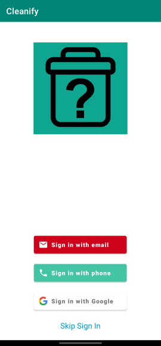
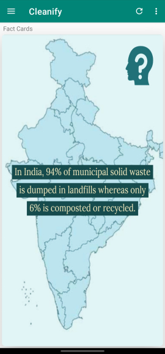
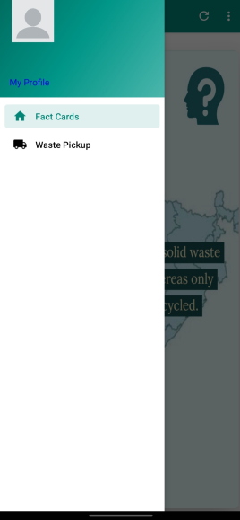
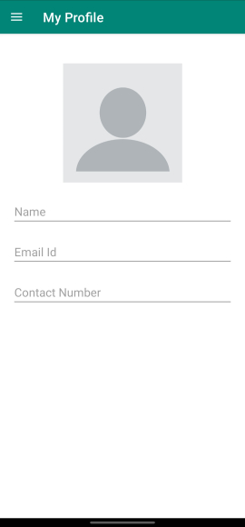
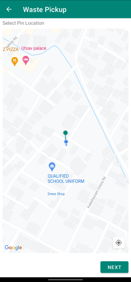
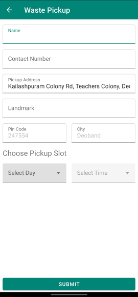

# Cleanify

This application is based on a potential business model that lets people to order doorstep pickup for the waste products.

## Features
- Sign-in using various authentication providers such as Phone Number, Google, etc.
- Fact Cards on home screen that are fetched over the internet.
- Google Maps integration with an option to select pin drop location while placing an order. 

## Upcoming Features
- An orders screen to track the status of the existing orders.

## Screnshots

